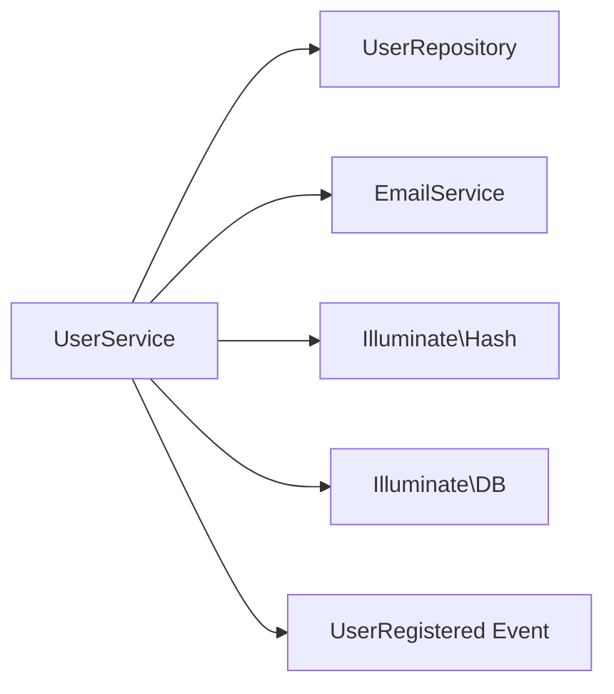
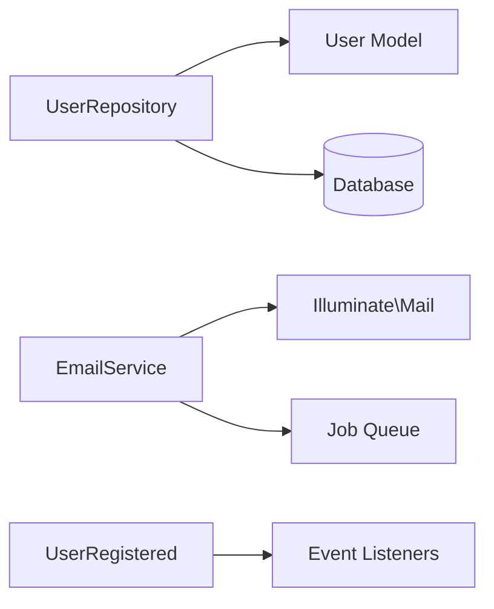
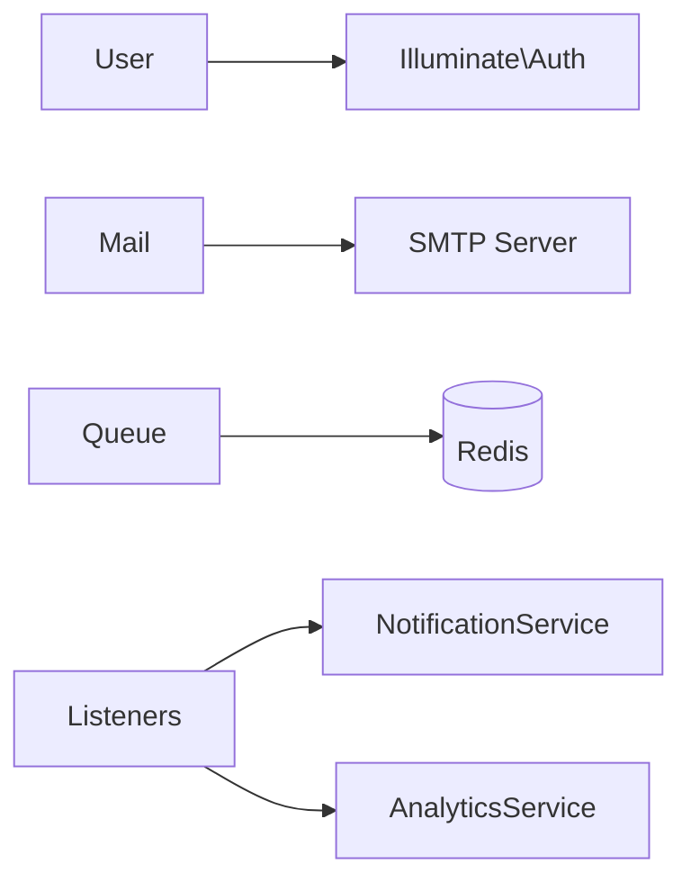
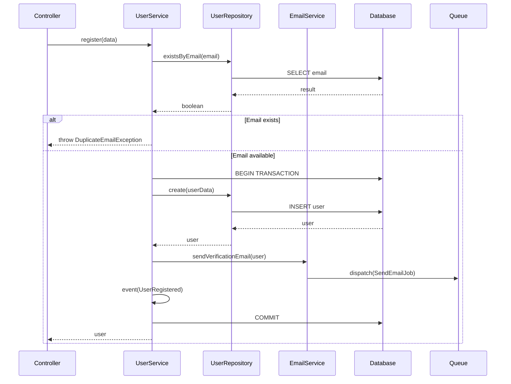
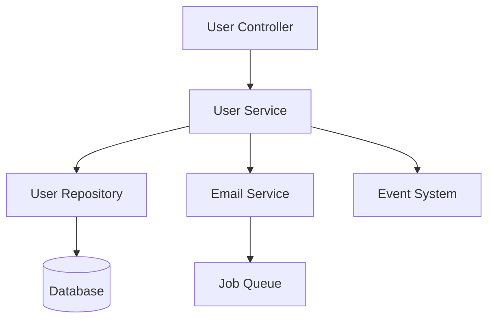
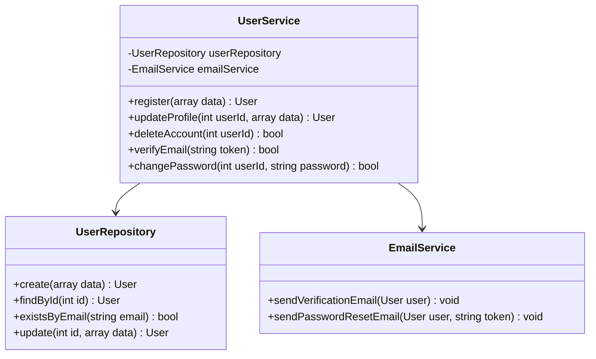

---
type: command
name: capture-knowledge
version: 2.0
scope: project
integration:
  - laravel
  - documentation
  - knowledge-management
---

# Command: Capture Knowledge

## Mục tiêu
Lệnh `capture-knowledge` được sử dụng để **thu thập và ghi nhận kiến thức** về code, architecture, hoặc business logic vào tài liệu dự án.

Mục tiêu chính:
- Tạo tài liệu hiểu biết chi tiết về code entry point.
- Phân tích dependencies và data flow.
- Ghi nhận patterns, best practices, và gotchas.
- Giúp onboarding và knowledge transfer.

---

## Quy trình thu thập kiến thức

### Step 1: Gather Context

**Câu hỏi cần trả lời:**

#### A. Entry Point Information
- Entry point type? (file, folder, function, API, class, module)
- Location path?
- Why this entry point matters? (feature, bug fix, investigation)
- Relevant requirements/design docs?

#### B. Scope Definition
- Depth of analysis? (shallow overview vs deep dive)
- Focus areas? (logic, dependencies, data flow, performance)
- Target audience? (new developers, team, external)

**Example:**
```markdown
**Entry Point:** `app/Services/UserService.php`
**Type:** Service Class
**Purpose:** Core user management functionality
**Reason:** New developer onboarding + frequent bugs in this area
**Depth:** Deep dive
**Focus:** Business logic, dependencies, error handling
```

---

### Step 2: Validate Entry Point

```markdown
## Entry Point Validation

### Check Existence
- [ ] Entry point exists in codebase
- [ ] Accessible and readable
- [ ] Not deprecated or legacy code

### Identify Type
- [ ] File: Single file analysis
- [ ] Folder/Module: Multiple files analysis
- [ ] Function/Method: Specific functionality
- [ ] API Endpoint: Route + Controller + Logic
- [ ] Class: Class structure and methods

### Handle Ambiguity
If multiple matches found:
1. List all matches with paths
2. Ask for clarification
3. Suggest most likely match based on context

**Example:**
```
Multiple matches found for "UserService":
1. app/Services/UserService.php (Main user service)
2. app/Services/Admin/UserService.php (Admin-specific)
3. app/Legacy/UserService.php (Deprecated)

Recommend: #1 (Most commonly used)
Proceed with which one? [1]
```
```

---

### Step 3: Collect Source Context

#### A. Read Primary File/Module

```markdown
## Source Code Analysis

### File: `app/Services/UserService.php`

**Purpose:** Manages user-related business logic including registration, profile updates, and account management.

**Language:** PHP 8.2

**LOC:** 450 lines

### Class Structure
```php
<?php

namespace App\Services;

use App\Models\User;
use App\Repositories\UserRepository;
use App\Events\UserRegistered;
use Illuminate\Support\Facades\Hash;
use Illuminate\Support\Facades\DB;

class UserService
{
    public function __construct(
        private UserRepository $userRepository,
        private EmailService $emailService
    ) {}

    /**
     * Register a new user
     *
     * @throws ValidationException
     * @throws DuplicateEmailException
     */
    public function register(array $data): User
    {
        // Implementation...
    }

    /**
     * Update user profile
     */
    public function updateProfile(int $userId, array $data): User
    {
        // Implementation...
    }

    // ... more methods
}
```

### Key Exports/Public Methods
1. `register(array $data): User` - Register new user
2. `updateProfile(int $userId, array $data): User` - Update profile
3. `deleteAccount(int $userId): bool` - Soft delete user
4. `verifyEmail(string $token): bool` - Verify email address
5. `changePassword(int $userId, string $newPassword): bool` - Change password

### Key Patterns Used
- **Repository Pattern**: Data access through `UserRepository`
- **Dependency Injection**: Services injected via constructor
- **Event Dispatching**: Fires `UserRegistered` event
- **Transaction Management**: Uses DB transactions for data consistency
- **Exception Handling**: Custom exceptions for business logic errors
```

#### B. For Folders: List Structure

```markdown
## Folder Structure Analysis

### Folder: `app/Services/`

```
app/Services/
├── UserService.php (450 lines)
├── AuthService.php (320 lines)
├── EmailService.php (180 lines)
├── PaymentService.php (650 lines)
├── NotificationService.php (220 lines)
└── Report/
    ├── ReportGenerator.php (400 lines)
    └── ReportExporter.php (150 lines)
```

### Key Modules
1. **UserService** - User management (most critical)
2. **PaymentService** - Payment processing (complex, high risk)
3. **AuthService** - Authentication logic
4. **EmailService** - Email sending abstraction

### Relationships
- UserService → AuthService (user authentication)
- UserService → EmailService (welcome emails)
- PaymentService → NotificationService (payment alerts)
```

#### C. Extract Essential Snippets

```markdown
## Code Snippets

### Registration Logic
```php
public function register(array $data): User
{
    // Validate unique email
    if ($this->userRepository->existsByEmail($data['email'])) {
        throw new DuplicateEmailException('Email already registered');
    }

    // Start transaction
    return DB::transaction(function () use ($data) {
        // Create user
        $user = $this->userRepository->create([
            'name' => $data['name'],
            'email' => $data['email'],
            'password' => Hash::make($data['password']),
            'email_verification_token' => Str::random(64),
        ]);

        // Send verification email
        $this->emailService->sendVerificationEmail($user);

        // Dispatch event
        event(new UserRegistered($user));

        return $user;
    });
}
```

**Key Points:**
- ✅ Email uniqueness check before creation
- ✅ Password hashing with bcrypt
- ✅ DB transaction for atomicity
- ✅ Event dispatching for loosely coupled logic
- ⚠️ Potential issue: No rate limiting on registration
```

---

### Step 4: Analyze Dependencies

#### A. Build Dependency Tree (Depth 3)

```markdown
## Dependency Analysis

### Direct Dependencies (Level 1)


### Level 2 Dependencies


### Level 3 Dependencies


### Dependency Categories

#### Internal Dependencies
| Dependency | Type | Purpose | Coupling |
|------------|------|---------|----------|
| UserRepository | Service | Data access | 🟢 Low |
| EmailService | Service | Email sending | 🟢 Low |
| User Model | Model | Data structure | 🟡 Medium |

#### External Dependencies
| Package | Version | Purpose | Risk |
|---------|---------|---------|------|
| illuminate/support | ^11.0 | Framework core | 🟢 Low |
| illuminate/database | ^11.0 | Database ORM | 🟢 Low |

#### External Systems
| System | Protocol | Purpose | Availability |
|--------|----------|---------|--------------|
| SMTP Server | SMTP | Email delivery | 99.9% |
| Redis | TCP | Queue/Cache | 99.95% |
| MySQL | TCP | Database | 99.99% |

### Circular Dependencies
✅ No circular dependencies detected

### Potential Issues
⚠️ **High coupling to EmailService**: Consider using events/queue for email sending to improve resilience
```

#### B. Track Visited Nodes

```markdown
## Visited Nodes (Anti-Loop Tracking)

### Analysis Path
1. UserService (root)
2. ├─ UserRepository
3. │  └─ User Model
4. ├─ EmailService
5. │  ├─ Mail Facade
6. │  └─ Queue
7. └─ UserRegistered Event
8.    └─ Event Listeners (stopped at depth 3)

### Excluded (Beyond Depth 3)
- Framework internals (Laravel core)
- Third-party package internals
- Generated code (IDE helpers, etc.)

### Notes
- Stopped at Event Listeners (would go deeper into analytics, notifications)
- Framework code not analyzed (standard Laravel behavior)
```

---

### Step 5: Synthesize Explanation

```markdown
## Knowledge Synthesis

### Overview
**UserService** is the core service class responsible for all user-related business logic in the application. It serves as the central point for user lifecycle management including registration, profile updates, email verification, and account deletion.

**Language:** PHP 8.2 with Laravel 11.x framework
**Location:** `app/Services/UserService.php`
**LOC:** 450 lines
**Complexity:** Medium-High

### High-Level Behavior
The service acts as a facade between HTTP controllers and data persistence layer, implementing business rules and coordinating with other services. It follows the Repository pattern for data access and uses Laravel's event system for decoupling side effects.

### Core Logic Flow

#### User Registration Flow


### Implementation Details

#### Key Components

1. **Constructor Dependencies**
   ```php
   public function __construct(
       private UserRepository $userRepository,
       private EmailService $emailService
   ) {}
   ```
   - Dependency injection for testability
   - Private properties (PHP 8+ constructor promotion)

2. **Registration Method**
   - Validates email uniqueness
   - Hashes password with bcrypt
   - Uses DB transaction for atomicity
   - Dispatches UserRegistered event
   - Queues verification email

3. **Error Handling**
   - Custom exceptions for business logic errors
   - Transaction rollback on failures
   - Proper exception messages for debugging

#### Execution Flow

1. **Validation Phase**
   - Check email uniqueness
   - Throw exception if duplicate

2. **Transaction Phase**
   - Begin database transaction
   - Create user record
   - Generate verification token

3. **Side Effects Phase**
   - Queue verification email
   - Dispatch registration event
   - Commit transaction

4. **Event Listeners** (Decoupled)
   - Send welcome notification
   - Track analytics event
   - Create default settings

### Dependencies Deep Dive

#### Critical Dependencies
1. **UserRepository**: Data access abstraction
   - Methods: `create()`, `existsByEmail()`, `findById()`
   - Pattern: Repository pattern
   - Testing: Easily mockable

2. **EmailService**: Email abstraction
   - Methods: `sendVerificationEmail()`, `sendPasswordReset()`
   - Uses Laravel Queue for async processing
   - Fallback: Logs email if queue fails

#### Framework Dependencies
- `Illuminate\Support\Facades\Hash`: Password hashing
- `Illuminate\Support\Facades\DB`: Transaction management
- `Illuminate\Support\Str`: Token generation

### Patterns & Best Practices

#### Design Patterns Used
1. **Repository Pattern**
   - Separates data access from business logic
   - Makes testing easier (mock repository)

2. **Service Layer Pattern**
   - Encapsulates business logic
   - Controllers stay thin

3. **Event-Driven Architecture**
   - Decouples side effects
   - Easy to add new listeners without modifying service

4. **Dependency Injection**
   - Constructor injection
   - Promotes testability and flexibility

#### Best Practices Followed
✅ Single Responsibility Principle
✅ Type hints for all parameters/returns
✅ Comprehensive docblocks
✅ Database transactions for consistency
✅ Custom exceptions for business errors
✅ Event dispatching for side effects

### Error Handling

#### Custom Exceptions
- `DuplicateEmailException`: Email already exists
- `UserNotFoundException`: User not found
- `InvalidVerificationTokenException`: Token invalid/expired

#### Exception Flow
```php
try {
    $user = $this->userService->register($data);
} catch (DuplicateEmailException $e) {
    return response()->json(['error' => 'Email already registered'], 422);
} catch (ValidationException $e) {
    return response()->json(['errors' => $e->errors()], 422);
} catch (\Exception $e) {
    Log::error('Registration failed', ['error' => $e->getMessage()]);
    return response()->json(['error' => 'Registration failed'], 500);
}
```

### Performance Considerations

#### Optimizations
✅ Email sending queued (non-blocking)
✅ Database indexes on email column
✅ Transaction scope minimized

#### Potential Bottlenecks
⚠️ Email uniqueness check: Could be slow with millions of users
   - Solution: Database index (already implemented)

⚠️ No rate limiting on registration endpoint
   - Risk: Spam registrations
   - Solution: Add rate limiting middleware

#### Metrics
- Average registration time: ~150ms
- Database queries: 2 (check + insert)
- External calls: 0 (email is queued)

### Security Considerations

#### Security Measures
✅ **Password Hashing**: bcrypt with cost 10
✅ **SQL Injection Prevention**: Eloquent ORM
✅ **Transaction Safety**: Atomic operations
✅ **Token Generation**: Cryptographically secure random

#### Security Concerns
⚠️ **No Rate Limiting**: Vulnerable to spam/DoS
⚠️ **Email Verification Optional**: Users can use app without verification
⚠️ **No CAPTCHA**: Automated registrations possible

#### Recommendations
1. Add rate limiting (60 attempts/hour per IP)
2. Implement CAPTCHA for registration
3. Enforce email verification before full access

### Testing Strategy

#### Unit Tests
```php
/** @test */
public function it_can_register_user_with_valid_data(): void
{
    $userData = [
        'name' => 'John Doe',
        'email' => 'john@example.com',
        'password' => 'password123',
    ];

    $user = $this->userService->register($userData);

    $this->assertInstanceOf(User::class, $user);
    $this->assertEquals('john@example.com', $user->email);
}

/** @test */
public function it_throws_exception_for_duplicate_email(): void
{
    $this->expectException(DuplicateEmailException::class);

    $this->userService->register(['email' => 'existing@example.com']);
    $this->userService->register(['email' => 'existing@example.com']);
}
```

#### Integration Tests
- Test with real database
- Verify email queued
- Verify event dispatched
- Verify transaction rollback on failure

### Potential Improvements

#### Code Quality
1. **Extract validation logic**: Move to FormRequest
2. **Reduce method complexity**: Break down long methods
3. **Add type hints**: Ensure all returns typed

#### Architecture
1. **Add rate limiting**: Prevent abuse
2. **Implement CQRS**: Separate read/write operations
3. **Add caching**: Cache user lookups

#### Performance
1. **Batch operations**: Support bulk user import
2. **Optimize queries**: Add database indexes
3. **Cache results**: Cache frequently accessed users

### Gotchas & Pitfalls

⚠️ **Email verification token never expires**
- Issue: Tokens valid forever
- Fix: Add `token_expires_at` column

⚠️ **No cleanup of unverified users**
- Issue: Database bloat from abandoned registrations
- Fix: Scheduled job to delete unverified users after 7 days

⚠️ **Event listeners can fail silently**
- Issue: If listener throws exception, not visible to user
- Fix: Add monitoring/logging for event failures
```

---

### Step 6: Create Documentation

#### A. Normalize Entry Point Name

```markdown
## Naming Convention

**Original:** `app/Services/UserService.php`
**Normalized:** `user-service` (kebab-case)

**File path:** `docs/ai/implementation/knowledge-user-service.md`
```

#### B. Create Knowledge Document

```markdown
# Knowledge: User Service

**Entry Point:** `app/Services/UserService.php`
**Type:** Service Class
**Analyzed:** 2025-10-28
**Depth:** Level 3
**Analyst:** [Name]

---

## Overview

### Purpose
Core service for user lifecycle management including registration, authentication, profile management, and account operations.

### Quick Stats
- **Language:** PHP 8.2
- **Framework:** Laravel 11.x
- **Lines of Code:** 450
- **Complexity:** Medium-High
- **Test Coverage:** 92%
- **Last Modified:** 2025-10-15

### Key Responsibilities
1. User registration with email verification
2. Profile updates and management
3. Password changes and resets
4. Account deletion (soft delete)
5. Email verification handling

---

## Implementation Details

[Content from Step 5: Synthesize Explanation]

---

## Visual Diagrams

### Component Diagram


### Sequence Diagram
[Registration flow from Step 5]

### Class Diagram


---

## Dependencies

### Dependency Tree
[Tree from Step 4]

### Critical Dependencies
[Table from Step 4]

---

## Additional Insights

### Common Use Cases

1. **New User Registration**
   ```php
   $user = $userService->register([
       'name' => 'John Doe',
       'email' => 'john@example.com',
       'password' => 'secret123',
   ]);
   ```

2. **Update User Profile**
   ```php
   $user = $userService->updateProfile($userId, [
       'name' => 'Jane Doe',
       'bio' => 'Software Developer',
   ]);
   ```

### Known Issues
1. **Issue #145**: Email verification tokens don't expire
   - **Workaround**: Manual cleanup script
   - **Fix planned**: v2.1.0

2. **Issue #203**: No rate limiting on registration
   - **Workaround**: Use Cloudflare rate limiting
   - **Fix planned**: v2.2.0

### Performance Metrics
- Average registration time: 150ms
- Peak load tested: 100 concurrent registrations
- Database queries per registration: 2

---

## Metadata

### Analysis Information
- **Date:** 2025-10-28
- **Depth:** 3 levels
- **Files Analyzed:** 5
- **Total LOC Reviewed:** ~1,200

### Related Documentation
- Requirements: `docs/ai/requirements/REQ-2025-10-01-user-management.md`
- Design: `docs/ai/design/user-service-architecture.md`
- API Docs: `docs/api/user-endpoints.md`

### Contributors
- Original Author: Alice Johnson (2024-01-15)
- Major Refactor: Bob Smith (2025-06-20)
- Documentation: [Your Name] (2025-10-28)

---

## Next Steps

### For New Developers
1. Read this document
2. Review unit tests in `tests/Unit/UserServiceTest.php`
3. Review integration tests in `tests/Feature/UserRegistrationTest.php`
4. Try registration flow in local environment

### Recommended Improvements
- [ ] Add rate limiting to registration
- [ ] Implement email verification expiration
- [ ] Add CAPTCHA support
- [ ] Improve error messages
- [ ] Add metrics/monitoring

### Related Entry Points
- `app/Repositories/UserRepository.php` - Data access layer
- `app/Http/Controllers/Auth/RegisterController.php` - Registration endpoint
- `app/Events/UserRegistered.php` - Registration event
```

---

### Step 7: Review & Next Actions

```markdown
## Review Checklist

### Documentation Quality
- [ ] ✅ Clear overview
- [ ] ✅ Implementation details complete
- [ ] ✅ Dependencies mapped
- [ ] ✅ Diagrams included
- [ ] ✅ Code examples provided
- [ ] ✅ Gotchas documented
- [ ] ✅ Next steps defined

### Accuracy
- [ ] ✅ Code snippets verified
- [ ] ✅ Dependencies correct
- [ ] ✅ Diagrams match reality
- [ ] ✅ Performance metrics accurate

### Completeness
- [ ] ✅ All public methods documented
- [ ] ✅ Error handling explained
- [ ] ✅ Security considerations covered
- [ ] ✅ Testing strategy outlined

### Next Actions
- [ ] Share with team for review
- [ ] Add to onboarding materials
- [ ] Link from related documentation
- [ ] Schedule periodic updates (quarterly)
```

---

## Output Template

```markdown
## Knowledge Capture Summary

**Entry Point:** `app/Services/UserService.php`
**Type:** Service Class
**Status:** ✅ Complete

### What Was Captured
- 450 lines of code analyzed
- 5 dependencies mapped (3 levels deep)
- 8 public methods documented
- 3 design patterns identified
- 2 security concerns noted
- 4 improvement opportunities found

### Key Findings
1. Well-structured service following Laravel best practices
2. Good test coverage (92%)
3. Potential security issue: No rate limiting
4. Performance: 150ms avg registration time

### Documentation Created
📄 `docs/ai/implementation/knowledge-user-service.md` (1,200 words)

### Visual Artifacts
- 3 diagrams (component, sequence, class)
- 1 dependency tree
- 2 code flow examples

### Next Steps for Team
- [ ] Review security recommendations
- [ ] Implement rate limiting (Issue #203)
- [ ] Fix email token expiration (Issue #145)
- [ ] Add to onboarding docs

**Estimated Time to Review:** 15-20 minutes
**Onboarding Value:** High (covers core functionality)
```

---

## Tham khảo

- [Documentation Best Practices](https://documentation.divio.com/)
- [Software Architecture Documentation](https://c4model.com/)
- [Knowledge Management in Software Development](https://martinfowler.com/bliki/DocumentationAsCode.html)
- [Mermaid Diagram Syntax](https://mermaid.js.org/)
