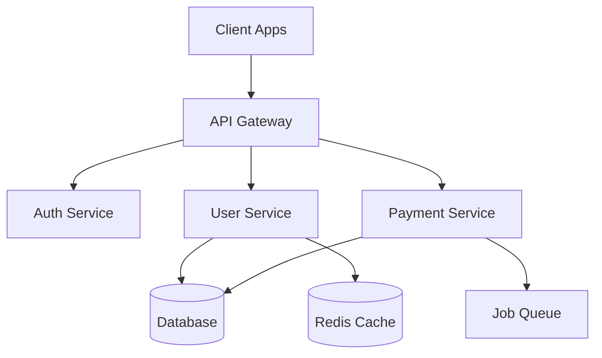
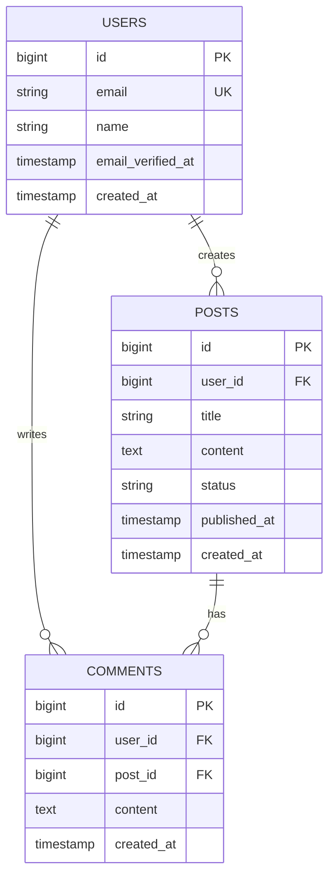

# Command: Review Design

## Mục tiêu
Lệnh `review-design` được sử dụng để **review và validate thiết kế kỹ thuật** trước khi implement.

Mục tiêu chính:
- Đảm bảo design giải quyết đúng requirement.
- Xác minh architecture phù hợp với hệ thống hiện tại.
- Phát hiện potential issues sớm.
- Đánh giá scalability, maintainability, security.

---

## Quy trình review

### Step 1: Gather Design Context

**Câu hỏi cần trả lời:**

#### A. Design Information
- Design document location?
- Requirement document reference?
- Author và date?
- Stakeholders involved?

#### B. Scope Understanding
- Feature/module đang được design?
- Integration points với hệ thống hiện tại?
- External dependencies?
- Data flow và processing logic?

---

### Step 2: Review Design Document Structure

```markdown
## Design Document Checklist

### Required Sections
- [ ] Overview & Objectives
- [ ] Architecture Diagram
- [ ] Data Model / Database Schema
- [ ] API Specification
- [ ] Security Considerations
- [ ] Performance Requirements
- [ ] Error Handling Strategy
- [ ] Testing Strategy

### Optional Sections (tùy complexity)
- [ ] Deployment Architecture
- [ ] Monitoring & Logging
- [ ] Rollback Strategy
- [ ] Migration Plan
```

---

### Step 3: Architecture Review

#### A. High-Level Architecture

```markdown
## Architecture Assessment

### Current Architecture


### Proposed Changes
- Add: User Profile Service
- Modify: Authentication to support OAuth
- Remove: Legacy session management

### Architecture Patterns Used
| Pattern | Usage | Justification | ✓ |
|---------|-------|---------------|---|
| Repository Pattern | Data access layer | Decouple business logic from DB | ✅ |
| Service Layer | Business logic | Single responsibility | ✅ |
| Factory Pattern | Object creation | Complex object instantiation | ✅ |
| Observer Pattern | Event handling | Decouple event producers/consumers | ✅ |
```

#### B. Design Principles Check

```markdown
### SOLID Principles

#### Single Responsibility Principle (SRP)
- [ ] ✅ Each class has one reason to change
- [ ] ✅ Controllers only delegate
- [ ] ✅ Services contain business logic
- [ ] ✅ Repositories handle data access

#### Open/Closed Principle (OCP)
- [ ] ✅ Classes open for extension
- [ ] ✅ Closed for modification
- [ ] ✅ Use interfaces for extensibility

#### Liskov Substitution Principle (LSP)
- [ ] ✅ Subtypes substitutable for base types
- [ ] ✅ No violations of base class contracts

#### Interface Segregation Principle (ISP)
- [ ] ✅ Interfaces are specific and focused
- [ ] ✅ No fat interfaces

#### Dependency Inversion Principle (DIP)
- [ ] ✅ Depend on abstractions, not concretions
- [ ] ✅ Use dependency injection
```

#### C. Laravel Best Practices

```markdown
### Laravel Architecture Checklist

#### Folder Structure
- [ ] ✅ Follow Laravel conventions
- [ ] ✅ Group by domain/feature (if using DDD)
- [ ] ✅ Clear separation of concerns

#### Service Providers
- [ ] ✅ Services registered properly
- [ ] ✅ Deferred providers where appropriate
- [ ] ✅ No heavy logic in boot()

#### Eloquent Models
- [ ] ✅ Models are thin (no business logic)
- [ ] ✅ Relationships defined correctly
- [ ] ✅ Proper use of scopes and accessors

#### Routes
- [ ] ✅ RESTful routing conventions
- [ ] ✅ Route model binding used
- [ ] ✅ Grouped by middleware/prefix
- [ ] ✅ API versioning (if applicable)

#### Middleware
- [ ] ✅ Middleware single responsibility
- [ ] ✅ Proper ordering
- [ ] ✅ No business logic in middleware
```

---

### Step 4: Data Model Review

#### A. Database Schema

```markdown
## Database Design Review

### ER Diagram


### Schema Checklist
- [ ] ✅ Proper data types chosen
- [ ] ✅ Primary keys defined
- [ ] ✅ Foreign keys with constraints
- [ ] ✅ Indexes on frequently queried columns
- [ ] ✅ Unique constraints where needed
- [ ] ✅ Default values set appropriately
- [ ] ✅ Timestamps (created_at, updated_at)
- [ ] ✅ Soft deletes if needed

### Normalization
- [ ] ✅ No data redundancy
- [ ] ✅ Proper normalization (3NF typically)
- [ ] ⚠️ Denormalization justified (if any)

### Indexing Strategy
| Table | Column(s) | Type | Justification |
|-------|-----------|------|---------------|
| users | email | UNIQUE | Login lookup |
| posts | user_id | INDEX | User's posts |
| posts | status, published_at | COMPOSITE | Published posts query |
| comments | post_id, created_at | COMPOSITE | Recent comments |
```

#### B. Migration Review

```php
// ✅ Good Migration
public function up(): void
{
    Schema::create('posts', function (Blueprint $table) {
        $table->id();
        $table->foreignId('user_id')->constrained()->onDelete('cascade');
        $table->string('title');
        $table->text('content');
        $table->enum('status', ['draft', 'published', 'archived'])->default('draft');
        $table->timestamp('published_at')->nullable();
        $table->timestamps();

        $table->index(['status', 'published_at']);
    });
}

public function down(): void
{
    Schema::dropIfExists('posts');
}

// ❌ Issues to Check
// - Missing onDelete/onUpdate
// - No indexes on foreign keys
// - No down() method
// - Using string instead of enum for status
```

---

### Step 5: API Design Review

#### A. API Specification

```markdown
## API Design Review

### Endpoint: Create User
**Method:** POST
**Path:** `/api/v1/users`

**Request:**
```json
{
  "name": "John Doe",
  "email": "john@example.com",
  "password": "secret123"
}
```

**Response (201 Created):**
```json
{
  "data": {
    "id": 1,
    "name": "John Doe",
    "email": "john@example.com",
    "created_at": "2025-10-28T10:00:00Z"
  }
}
```

**Error Response (422 Unprocessable Entity):**
```json
{
  "message": "Validation failed",
  "errors": {
    "email": ["The email has already been taken."]
  }
}
```

### API Design Checklist
- [ ] ✅ RESTful conventions followed
- [ ] ✅ Proper HTTP methods (GET, POST, PUT, DELETE)
- [ ] ✅ Correct status codes (200, 201, 400, 404, 500, etc.)
- [ ] ✅ Consistent response structure
- [ ] ✅ Error messages clear and actionable
- [ ] ✅ Pagination for list endpoints
- [ ] ✅ Filtering and sorting options
- [ ] ✅ API versioning strategy
- [ ] ✅ Rate limiting defined
- [ ] ✅ Authentication/Authorization specified
```

#### B. API Resource Design

```php
// ✅ Good API Resource
class UserResource extends JsonResource
{
    public function toArray($request): array
    {
        return [
            'id' => $this->id,
            'name' => $this->name,
            'email' => $this->email,
            'profile' => new ProfileResource($this->whenLoaded('profile')),
            'created_at' => $this->created_at->toIso8601String(),
            'links' => [
                'self' => route('users.show', $this->id),
            ],
        ];
    }
}

// ❌ Issues to Check
// - Exposing sensitive data (password, tokens)
// - Inconsistent date formats
// - N+1 query problems (missing whenLoaded)
// - No HATEOAS links
```

---

### Step 6: Security Review

```markdown
## Security Design Review

### Authentication & Authorization
- [ ] ✅ Authentication method chosen (Sanctum/Passport)
- [ ] ✅ Token expiration configured
- [ ] ✅ Refresh token strategy
- [ ] ✅ Authorization policies defined
- [ ] ✅ Role-based access control (if needed)

### Data Protection
- [ ] ✅ Passwords hashed (bcrypt/argon2)
- [ ] ✅ Sensitive data encrypted
- [ ] ✅ PII handling compliant with regulations
- [ ] ✅ No sensitive data in logs

### Input Validation
- [ ] ✅ All inputs validated
- [ ] ✅ Type checking
- [ ] ✅ Range/length validation
- [ ] ✅ Sanitization strategy

### Output Encoding
- [ ] ✅ XSS prevention (Blade escaping)
- [ ] ✅ JSON encoding secure
- [ ] ✅ SQL injection prevented (Eloquent)

### API Security
- [ ] ✅ Rate limiting configured
- [ ] ✅ CORS policy defined
- [ ] ✅ CSRF protection enabled
- [ ] ✅ API key/token validation

### Security Headers
- [ ] ✅ Content-Security-Policy
- [ ] ✅ X-Frame-Options
- [ ] ✅ X-Content-Type-Options
- [ ] ✅ Strict-Transport-Security (HTTPS)

### Threats Considered
| Threat | Mitigation | Status |
|--------|------------|--------|
| SQL Injection | Eloquent ORM | ✅ |
| XSS | Blade escaping | ✅ |
| CSRF | Laravel CSRF tokens | ✅ |
| Session Hijacking | Secure cookies, HTTPS | ✅ |
| Brute Force | Rate limiting | ✅ |
| Data Exposure | Proper access control | ✅ |
```

---

### Step 7: Performance & Scalability Review

```markdown
## Performance Design Review

### Database Performance
- [ ] ✅ Queries optimized (no SELECT *)
- [ ] ✅ Proper indexing strategy
- [ ] ✅ Eager loading to prevent N+1
- [ ] ✅ Pagination for large datasets
- [ ] ✅ Database connection pooling

### Caching Strategy
| Data Type | Cache Method | TTL | Invalidation |
|-----------|--------------|-----|--------------|
| User profile | Redis cache | 1 hour | On update |
| Settings | Config cache | Forever | Manual clear |
| API responses | HTTP cache | 5 min | Time-based |
| Query results | Query cache | 10 min | Tag-based |

### Scalability Considerations
- [ ] ✅ Stateless design (horizontal scaling)
- [ ] ✅ Queue for long-running tasks
- [ ] ✅ CDN for static assets
- [ ] ✅ Database read replicas (if needed)
- [ ] ✅ Load balancing strategy

### Performance Targets
| Metric | Target | How to Measure |
|--------|--------|----------------|
| API Response Time | < 200ms | Application monitoring |
| Database Query Time | < 50ms | Query logging |
| Cache Hit Rate | > 80% | Redis INFO |
| Concurrent Users | 1000+ | Load testing |
| Uptime | 99.9% | Monitoring tools |
```

---

### Step 8: Error Handling & Resilience

```markdown
## Error Handling Design

### Exception Strategy
```php
// ✅ Good Exception Handling
class UserService
{
    /**
     * @throws UserNotFoundException
     * @throws ValidationException
     */
    public function updateUser(int $id, array $data): User
    {
        $user = User::find($id);

        if (!$user) {
            throw new UserNotFoundException("User {$id} not found");
        }

        $validated = $this->validator->validate($data);

        return $user->update($validated);
    }
}
```

### Error Handling Checklist
- [ ] ✅ Custom exceptions for business logic
- [ ] ✅ Proper HTTP status codes
- [ ] ✅ User-friendly error messages
- [ ] ✅ Detailed logs for debugging
- [ ] ✅ No sensitive info in error responses

### Resilience Patterns
- [ ] ✅ Retry logic for transient failures
- [ ] ✅ Circuit breaker for external APIs
- [ ] ✅ Timeout configuration
- [ ] ✅ Graceful degradation
- [ ] ✅ Fallback strategies
```

---

### Step 9: Testing Strategy Review

```markdown
## Testing Design Review

### Test Pyramid
```
       /\
      /  \  E2E (10%)
     /____\
    /      \  Integration (30%)
   /________\
  /          \  Unit Tests (60%)
 /____________\
```

### Test Coverage Plan
| Component | Unit Tests | Integration Tests | E2E Tests |
|-----------|------------|-------------------|-----------|
| Services | ✅ 100% | - | - |
| Controllers | ⚠️ 80% | ✅ Critical paths | - |
| Models | ✅ 100% | - | - |
| API Endpoints | - | ✅ All endpoints | ✅ Happy paths |

### Testing Considerations
- [ ] ✅ Mockable dependencies
- [ ] ✅ Test data factories defined
- [ ] ✅ Database seeding strategy
- [ ] ✅ Test isolation strategy
- [ ] ✅ CI/CD integration plan
```

---

### Step 10: Documentation Review

```markdown
## Documentation Assessment

### Technical Documentation
- [ ] ✅ Architecture diagram included
- [ ] ✅ Data model documented
- [ ] ✅ API specification complete
- [ ] ✅ Sequence diagrams for complex flows
- [ ] ✅ Deployment instructions

### Code Documentation
- [ ] ✅ Inline comments for complex logic
- [ ] ✅ Docblocks for all public methods
- [ ] ✅ README updated
- [ ] ⚠️ Examples provided

### API Documentation
- [ ] ✅ OpenAPI/Swagger spec
- [ ] ✅ Authentication guide
- [ ] ✅ Error codes documented
- [ ] ✅ Rate limits specified
```

---

## Design Review Report Template

```markdown
# Design Review Report

**Feature:** [Feature Name]
**Design Document:** [Link]
**Reviewer:** [Name]
**Date:** [YYYY-MM-DD]

---

## Executive Summary

**Overall Assessment:** ✅ Approved | ⚠️ Approved with Comments | ❌ Changes Required

**Summary:**
[2-3 sentences về design quality và recommendations]

---

## Detailed Review

### Architecture
**Score:** 9/10
**Strengths:**
- Clear separation of concerns
- Follows Laravel best practices
- Good use of design patterns

**Concerns:**
- Service layer could be split further
- Consider caching strategy for frequently accessed data

### Data Model
**Score:** 10/10
**Strengths:**
- Proper normalization
- Good indexing strategy
- Relationships well-defined

**Concerns:**
None

### API Design
**Score:** 8/10
**Strengths:**
- RESTful conventions followed
- Consistent response structure

**Concerns:**
- Add pagination to list endpoints
- Consider API versioning

### Security
**Score:** 10/10
**Strengths:**
- All OWASP concerns addressed
- Proper authentication/authorization

**Concerns:**
None

### Performance
**Score:** 7/10
**Strengths:**
- Good caching strategy
- Query optimization considered

**Concerns:**
- Load testing plan needed
- Consider read replicas for scale

---

## Issues & Recommendations

### 🔴 Critical (Must Fix)
None

### 🟡 Important (Should Fix)
1. **Add pagination to user list endpoint**
   - Current design returns all users
   - Recommendation: Implement cursor pagination
   - Priority: High

2. **Define API versioning strategy**
   - No versioning in current design
   - Recommendation: Add /v1/ prefix
   - Priority: Medium

### 🟢 Minor (Nice to Have)
1. **Add caching for settings endpoint**
   - Could improve performance
   - Priority: Low

---

## Approval Status

- [ ] ✅ Architecture approved
- [ ] ✅ Data model approved
- [ ] ⚠️ API design approved with changes
- [ ] ✅ Security approved
- [ ] ⚠️ Performance approved with monitoring plan

**Overall Decision:** ⚠️ Approved with minor changes

**Required Actions Before Implementation:**
1. Add pagination to list endpoints
2. Define API versioning strategy
3. Create load testing plan

**Sign-off:**
- Designer: [Name] - [Date]
- Reviewer: [Name] - [Date]
- Tech Lead: [Name] - [Date]

---

## Next Steps

- [ ] Address critical issues
- [ ] Update design document
- [ ] Schedule follow-up review (if needed)
- [ ] Proceed to implementation
```

---

## Review Checklist Summary

```markdown
## Quick Review Checklist

### Architecture (Weight: 25%)
- [ ] Follows SOLID principles
- [ ] Appropriate design patterns
- [ ] Clear separation of concerns
- [ ] Scalable and maintainable

### Data Model (Weight: 20%)
- [ ] Proper normalization
- [ ] Good indexing strategy
- [ ] Relationships correct
- [ ] Migration quality

### API Design (Weight: 20%)
- [ ] RESTful conventions
- [ ] Consistent structure
- [ ] Proper error handling
- [ ] Documentation complete

### Security (Weight: 20%)
- [ ] Authentication/Authorization
- [ ] Input validation
- [ ] Data protection
- [ ] OWASP compliance

### Performance (Weight: 10%)
- [ ] Query optimization
- [ ] Caching strategy
- [ ] Scalability plan
- [ ] Performance targets

### Testing (Weight: 5%)
- [ ] Test strategy defined
- [ ] Coverage goals set
- [ ] Mockable design

**Overall Score:** [X]/100
```

---

## Tools & Resources

```bash
# Generate ER diagram from migrations
php artisan migrate:generate-erd

# Analyze database schema
php artisan db:show

# Generate API documentation
php artisan l5-swagger:generate

# Architecture visualization
php artisan architect:analyze
```

---

## Tham khảo

- [Laravel Architecture Best Practices](https://laravel.com/docs/architecture)
- [Clean Architecture](https://blog.cleancoder.com/uncle-bob/2012/08/13/the-clean-architecture.html)
- [API Design Guide](https://cloud.google.com/apis/design)
- [Database Design Best Practices](https://www.sqlshack.com/database-design-best-practices/)
- [SOLID Principles](https://en.wikipedia.org/wiki/SOLID)
