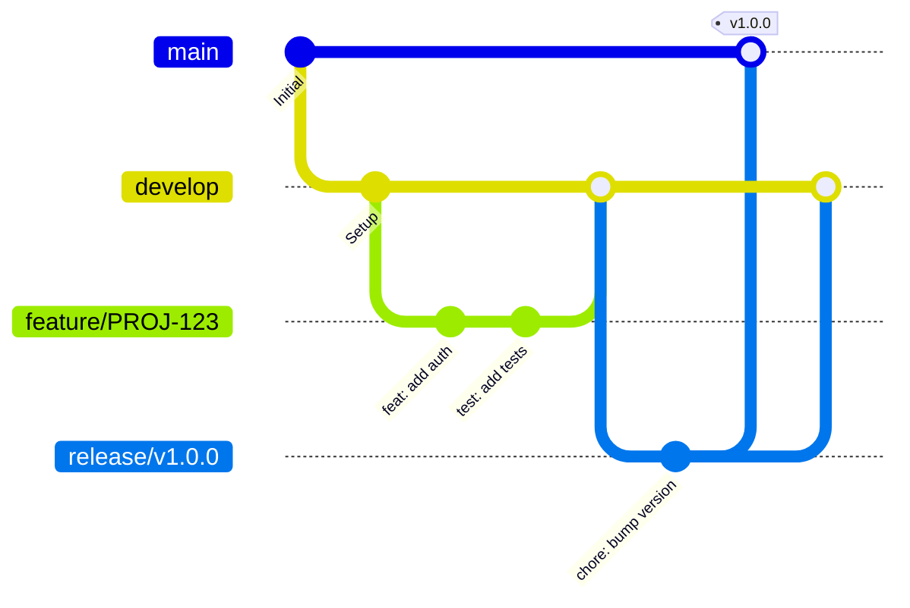

# Rule: Git Workflow & Commit Standards

## Intent
This rule defines Git workflow and commit message standards for the project. Following these conventions ensures a clean, traceable version history and facilitates collaboration, code review, and project maintenance.

## Scope
Applies to all Git operations including branching, committing, merging, and pull requests.

---

## 1. Branch Naming Convention

### Branch Types & Naming

**Format:** `<type>/<ticket-id>/<short-description>`

```bash
# Feature branches
feature/PROJ-123/user-authentication
feature/PROJ-456/payment-integration

# Bug fix branches
bugfix/PROJ-789/fix-login-validation
bugfix/PROJ-012/resolve-memory-leak

# Hotfix branches (urgent production fixes)
hotfix/PROJ-345/critical-security-patch
hotfix/PROJ-678/payment-gateway-down

# Enhancement branches
enhancement/PROJ-234/improve-search-performance
enhancement/PROJ-567/add-export-feature

# Documentation branches
docs/PROJ-890/update-api-documentation
docs/update-readme

# Refactor branches
refactor/PROJ-111/restructure-service-layer
refactor/optimize-queries

# Release branches
release/v1.2.0
release/v2.0.0-beta
```

### Branch Naming Rules
- ✅ Use lowercase
- ✅ Use hyphens to separate words
- ✅ Include ticket/issue ID when applicable
- ✅ Be descriptive but concise
- ❌ Don't use special characters except `/` and `-`
- ❌ Don't use personal names

**Examples:**
```bash
# ✅ Good
git checkout -b feature/PROJ-123/add-user-roles
git checkout -b bugfix/PROJ-456/fix-email-validation
git checkout -b hotfix/security-vulnerability

# ❌ Bad
git checkout -b john-branch
git checkout -b fix
git checkout -b FEATURE/Add_User_Roles
git checkout -b my_feature_branch
```

---

## 2. Commit Message Format

### Conventional Commits

**Format:** `<type>(<scope>): <subject>`

```
<type>(<scope>): <subject>

<body>

<footer>
```

### Commit Types
```
feat:     New feature
fix:      Bug fix
docs:     Documentation changes
style:    Code style changes (formatting, missing semi-colons, etc.)
refactor: Code refactoring (no functional changes)
perf:     Performance improvements
test:     Adding or updating tests
build:    Build system changes (dependencies, scripts)
ci:       CI/CD configuration changes
chore:    Other changes (maintenance, tooling)
revert:   Revert a previous commit
```

### Commit Message Examples

**Good Examples:**
```bash
# ✅ Feature
feat(auth): add JWT token authentication

# ✅ Bug fix
fix(payment): resolve Stripe webhook timeout issue

Increased timeout from 5s to 30s to handle high-traffic periods.
Closes #456

# ✅ Documentation
docs(api): update authentication endpoint examples

# ✅ Performance
perf(database): add indexes to posts table

Added indexes on user_id and status columns to improve query performance.
Reduces query time from 2.5s to 0.3s on production dataset.

# ✅ Refactor
refactor(user-service): extract validation logic to separate class

# ✅ Test
test(auth): add integration tests for login flow

# ✅ Breaking change
feat(api)!: change response format for user endpoints

BREAKING CHANGE: User API now returns data in camelCase instead of snake_case.
Migration guide available in docs/migration-v2.md
```

**Bad Examples:**
```bash
# ❌ Too vague
git commit -m "fix bug"
git commit -m "update"
git commit -m "changes"

# ❌ Not descriptive
git commit -m "fixed it"
git commit -m "WIP"
git commit -m "asdf"

# ❌ Wrong format
git commit -m "Fixed the login bug that was causing issues"
git commit -m "Add feature" # Missing scope and proper description
```

### Commit Message Rules
- ✅ Use imperative mood: "add feature" not "added feature"
- ✅ Don't capitalize first letter of subject
- ✅ No period at the end of subject
- ✅ Limit subject line to 50 characters
- ✅ Wrap body at 72 characters
- ✅ Separate subject from body with blank line
- ✅ Use body to explain *what* and *why*, not *how*

**Template:**
```bash
feat(scope): add amazing new feature

This commit adds a new feature that allows users to do X.
It improves the user experience by enabling Y functionality.

The implementation uses Z approach because:
- Reason 1
- Reason 2

Closes #123
```

---

## 3. Git Workflow

### Main Branches

```
main (or master)    - Production-ready code
develop             - Integration branch for features
```

### Branch Workflow



### Development Workflow

**1. Start New Feature:**
```bash
# Update develop branch
git checkout develop
git pull origin develop

# Create feature branch
git checkout -b feature/PROJ-123/user-authentication

# Work on feature
# ... make changes ...

# Commit changes
git add .
git commit -m "feat(auth): implement JWT authentication"

# Push to remote
git push origin feature/PROJ-123/user-authentication
```

**2. Keep Branch Updated:**
```bash
# Regularly sync with develop
git checkout develop
git pull origin develop

git checkout feature/PROJ-123/user-authentication
git rebase develop
# or
git merge develop

# Push updates
git push origin feature/PROJ-123/user-authentication --force-with-lease
```

**3. Create Pull Request:**
- Open PR from feature branch to `develop`
- Fill PR template with description, testing notes
- Request code review
- Address review comments
- Squash/merge when approved

**4. Clean Up:**
```bash
# After PR is merged
git checkout develop
git pull origin develop

# Delete local branch
git branch -d feature/PROJ-123/user-authentication

# Delete remote branch (if not auto-deleted)
git push origin --delete feature/PROJ-123/user-authentication
```

---

## 4. Pull Request (PR) Guidelines

### PR Title Format
```
[PROJ-123] Add user authentication with JWT
[PROJ-456] Fix payment webhook timeout
[PROJ-789] Refactor user service layer
```

### PR Description Template
```markdown
## Description
Brief description of what this PR does.

## Type of Change
- [ ] Bug fix (non-breaking change which fixes an issue)
- [ ] New feature (non-breaking change which adds functionality)
- [ ] Breaking change (fix or feature that would cause existing functionality to not work as expected)
- [ ] Documentation update

## Related Issue
Closes #123

## Changes Made
- Added JWT authentication middleware
- Implemented login/logout endpoints
- Added user registration flow
- Updated API documentation

## Testing
- [ ] Unit tests added/updated
- [ ] Integration tests added/updated
- [ ] Manual testing completed

### Test Cases Covered
1. User can register with valid credentials
2. User receives JWT token on successful login
3. Protected routes require valid token
4. Token expires after configured time

## Screenshots (if applicable)
[Add screenshots here]

## Checklist
- [ ] Code follows project style guidelines
- [ ] Self-review completed
- [ ] Comments added for complex logic
- [ ] Documentation updated
- [ ] No new warnings generated
- [ ] Tests added/updated and passing
- [ ] Dependent changes merged and published
```

### PR Best Practices
- ✅ Keep PRs small and focused (< 400 lines changed)
- ✅ Write clear description of changes
- ✅ Link related issues
- ✅ Add screenshots for UI changes
- ✅ Ensure CI/CD passes
- ✅ Request review from relevant team members
- ✅ Respond to review comments promptly
- ❌ Don't mix unrelated changes
- ❌ Don't submit work-in-progress PRs (use draft)

---

## 5. Code Review Guidelines

### As a Reviewer
```markdown
# ✅ Good review comments
"This function is doing too much. Consider extracting the validation logic
into a separate method for better testability."

"Great work on the error handling! One suggestion: we should also log
the error details for debugging purposes."

"The N+1 query issue here could be resolved by eager loading the relationship.
See: https://laravel.com/docs/eloquent-relationships#eager-loading"

# ❌ Bad review comments
"This is wrong."
"Change this."
"Why did you do it this way?"
```

### Review Checklist
- [ ] Code follows project conventions (PSR-12, Laravel standards)
- [ ] No security vulnerabilities introduced
- [ ] Tests are adequate and passing
- [ ] No performance issues (N+1 queries, missing indexes)
- [ ] Error handling is appropriate
- [ ] Documentation updated if needed
- [ ] No sensitive data exposed (credentials, API keys)
- [ ] Code is readable and maintainable

---

## 6. Commit Best Practices

### Atomic Commits
```bash
# ✅ Good - Separate logical changes
git commit -m "feat(auth): add JWT token generation"
git commit -m "feat(auth): add login endpoint"
git commit -m "test(auth): add login integration tests"

# ❌ Bad - Multiple unrelated changes
git commit -m "add auth and fix bugs and update docs"
```

### When to Commit
- ✅ After completing a logical unit of work
- ✅ Before switching tasks
- ✅ After tests pass
- ✅ End of day (if needed)
- ❌ Massive commits with hundreds of changes
- ❌ Broken/non-compiling code (except WIP branches)

### Amending Commits
```bash
# Fix last commit (haven't pushed yet)
git commit --amend -m "feat(auth): add JWT token generation"

# Add forgotten files to last commit
git add forgotten-file.php
git commit --amend --no-edit

# ⚠️ Never amend commits that have been pushed to shared branches
```

### Interactive Rebase (Clean Up History)
```bash
# Clean up last 3 commits before pushing
git rebase -i HEAD~3

# In editor, you can:
# pick   = use commit
# reword = use commit but edit message
# squash = combine with previous commit
# fixup  = like squash but discard message
# drop   = remove commit

# Example:
pick abc123 feat(auth): add JWT
fixup def456 fix typo
reword ghi789 test(auth): add tests
```

---

## 7. .gitignore Best Practices

### Laravel .gitignore
```gitignore
# Dependencies
/node_modules
/vendor

# Environment
.env
.env.backup
.env.production

# IDE
.idea/
.vscode/
*.sublime-project
*.sublime-workspace

# OS
.DS_Store
Thumbs.db

# Laravel
/storage/*.key
/storage/logs/*.log
/storage/framework/cache/*
/storage/framework/sessions/*
/storage/framework/views/*
/public/hot
/public/storage

# Build
/public/build

# Testing
coverage/
.phpunit.result.cache
```

---

## 8. Git Aliases (Optional)

### Useful Aliases
```bash
# ~/.gitconfig
[alias]
    co = checkout
    br = branch
    ci = commit
    st = status
    last = log -1 HEAD
    unstage = reset HEAD --

    # Pretty log
    lg = log --graph --pretty=format:'%Cred%h%Creset -%C(yellow)%d%Creset %s %Cgreen(%cr) %C(bold blue)<%an>%Creset' --abbrev-commit

    # Show files changed in last commit
    dl = diff --name-only HEAD~1 HEAD

    # Undo last commit but keep changes
    undo = reset HEAD~1 --soft
```

---

## 9. Common Git Commands

### Daily Workflow
```bash
# Check status
git status

# Stage changes
git add .
git add -p  # Interactive staging

# Commit
git commit -m "feat(scope): description"

# Push
git push origin branch-name

# Pull latest changes
git pull origin develop

# Create branch
git checkout -b feature/PROJ-123/description

# Switch branch
git checkout develop

# Delete branch
git branch -d branch-name
```

### Undoing Changes
```bash
# Discard changes in working directory
git checkout -- file.php

# Unstage file
git reset HEAD file.php

# Undo last commit (keep changes)
git reset HEAD~1 --soft

# Undo last commit (discard changes)
git reset HEAD~1 --hard

# Revert a commit (create new commit)
git revert abc123
```

### Stashing
```bash
# Stash current changes
git stash

# Stash with message
git stash save "WIP: working on feature"

# List stashes
git stash list

# Apply stash
git stash apply
git stash apply stash@{2}

# Pop stash (apply and remove)
git stash pop

# Drop stash
git stash drop stash@{0}
```

---

## 10. Merge vs Rebase

### When to Use Merge
- ✅ Merging feature branch into develop
- ✅ Merging develop into main (release)
- ✅ Public/shared branches

```bash
git checkout develop
git merge feature/PROJ-123/user-auth
```

### When to Use Rebase
- ✅ Updating feature branch with latest develop
- ✅ Cleaning up local commits before PR
- ✅ Personal/feature branches

```bash
git checkout feature/PROJ-123/user-auth
git rebase develop
```

### Golden Rule
**Never rebase commits that have been pushed to a shared branch!**

---

## 11. Emergency Procedures

### Recover Deleted Branch
```bash
# Find commit hash
git reflog

# Recreate branch
git checkout -b recovered-branch abc123
```

### Fix Wrong Branch Commit
```bash
# Move commits to correct branch
git checkout correct-branch
git cherry-pick abc123  # Commit hash from wrong branch

# Remove from wrong branch
git checkout wrong-branch
git reset HEAD~1 --hard
```

### Resolve Merge Conflicts
```bash
# When conflict occurs
git status  # See conflicted files

# Edit files to resolve conflicts
# Look for <<<<<<< HEAD markers

# Stage resolved files
git add resolved-file.php

# Complete merge
git commit -m "fix: resolve merge conflicts"
```

---

## 12. Git Workflow Checklist

### Before Committing
- [ ] Code compiles/runs without errors
- [ ] Tests pass
- [ ] Code follows style guidelines
- [ ] No debug code left (console.log, dd(), var_dump())
- [ ] No sensitive data in code

### Before Pushing
- [ ] Commits are atomic and well-described
- [ ] Branch is up to date with base branch
- [ ] All tests passing
- [ ] No merge conflicts

### Before Creating PR
- [ ] Feature is complete
- [ ] All commits follow conventions
- [ ] Tests added/updated
- [ ] Documentation updated
- [ ] Self-review completed

---

## References

- [Conventional Commits](https://www.conventionalcommits.org/)
- [Git Flow](https://nvie.com/posts/a-successful-git-branching-model/)
- [GitHub Flow](https://guides.github.com/introduction/flow/)
- [Git Best Practices](https://git-scm.com/book/en/v2/Distributed-Git-Contributing-to-a-Project)
- [How to Write a Git Commit Message](https://chris.beams.io/posts/git-commit/)
